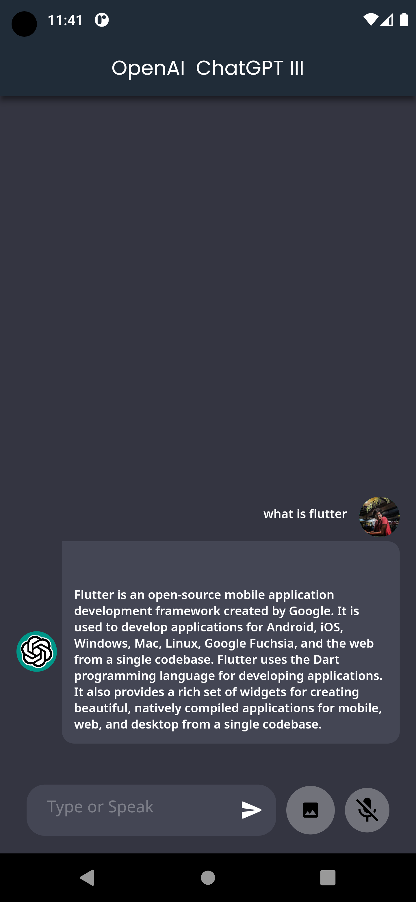
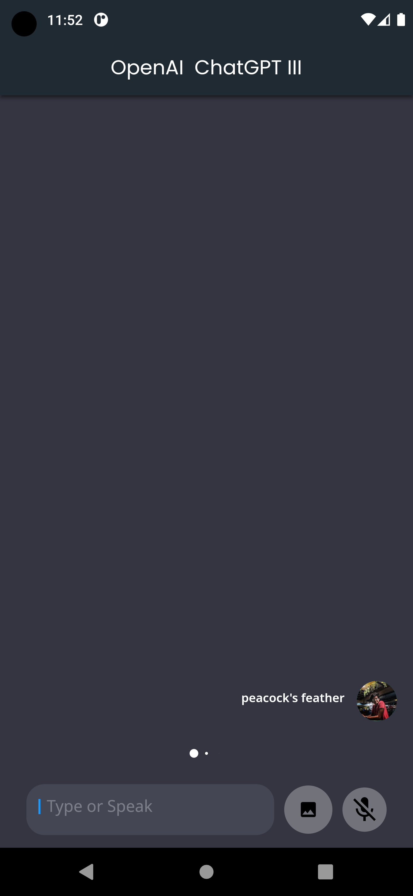
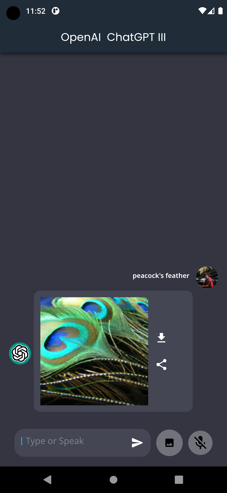

# ChatGPT III Flutter
ChatGPT incorporated into Mobile App using Flutter & Dart.


## Getting Started

+ Get Dependencies
    ```bash
    flutter pub get
    ```

+ Environment Variable
    ```python
    Create a new file called at the root directory called ".env" and store your API key in string format.
    ```

## Results
<p>

&nbsp;

</p>

<p>

&nbsp;

</p>

<p>

&nbsp;

</p>

## References
+ google_fonts <br>
+ google_nav_bar <br>
+ avatar_glow <br>
+ flutter_dotenv <br>
+ speech_to_text <br>
+ http <br>
+ flutter_launcher_icons <br>
+ Motion Toast
+ Flutter Spin Kit
+ Animated Text Kit